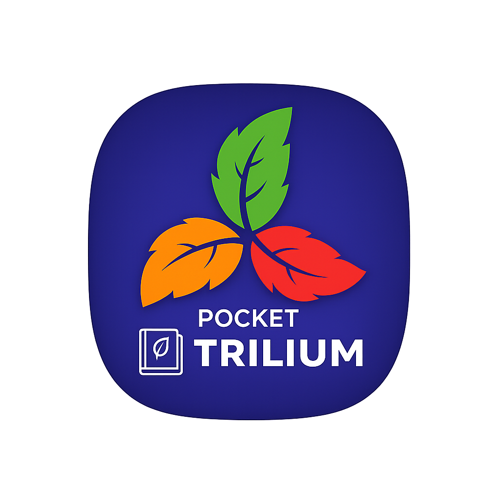

# 📱 Pocket Trilium

**Run full-featured Trilium on Android. Take your second brain with you, right in your pocket :)**

Please stand up and stretch your body for a while if you see this message :)

This project is inspired by and heavily modified from the [Cateners/tiny_computer](https://github.com/Cateners/tiny_computer) project.

# 📝 Overview

Pocket Trilium allows you to run the powerful [Trilium Notes](https://github.com/zadam/trilium) app on Android devices. While originally based on the [tiny_computer](https://github.com/Cateners/tiny_computer) project, this version has undergone significant modifications to better suit my needs.

# ⚙️ Setup Instructions

1. **Create the `trilium-data` Folder**:

    * On your phone’s internal storage, create a folder named `trilium-data`.
    * (Recommended) Alternatively, you can copy the `trilium-data` folder from your desktop client to your phone.

2. **Developer Options (Android 12+ Only)**:
   If you're using an Android 12+ device, you may need to disable the "Stop restricting child processes" option in the `Developer Options` menu.

# 🚧 Known issues

## ❌ App Fails to Start Occasionally

If the app fails to start and you encounter an error such as `double free or corruption`, try the following:

1. Force close the app.
2. Wait a few seconds to allow the system to terminate any associated processes.
3. Restart the app.

If needed, repeat this process a few times. The app should eventually start successfully.

# 🚀 Improvements

- The APK size has reduced from over 1GB with 4GB of data to approximately 360MB with 1GB of data. Additionally, the first time startup time has decreased dramatically.
- Image upload is now working in the app.

# 🎉 Credits

A huge thank you to the [Cateners/tiny_computer](https://github.com/Cateners/tiny_computer) project for laying the groundwork for this project. The initial code for **Pocket Trilium** was based on the following commit: [6425e04](https://github.com/Cateners/tiny_computer/tree/6425e0443efce97b9882c76294bd4271daf39996).

While I’ve made many changes to adapt the project to my use case, I decided to start a new repository instead of maintaining it as a fork, since the goals of this project diverged significantly from the original.

Thank [Zadam](https://github.com/zadam) for creating the wonderful Trilium in the first place. Thanks to everyone in the Trilium community.

And some credit to my old studies years ago :) [Tutorial to Run Trilium Server in Termux on Android](https://github.com/orgs/TriliumNext/discussions/4542) and [Tutorial: Run TriliumNext Server in Termux on Android](https://github.com/orgs/TriliumNext/discussions/5992).

# 📝 License

This project is licensed under the **GNU Affero General Public License v3.0**. See the [LICENSE](LICENSE) file for more details.

# 💖 Donation

Hello! If you appreciate my creations, kindly consider backing me. Your support is greatly appreciated. Thank you!

Ko-fi:  

Alipay:  

Wechat Pay:  

