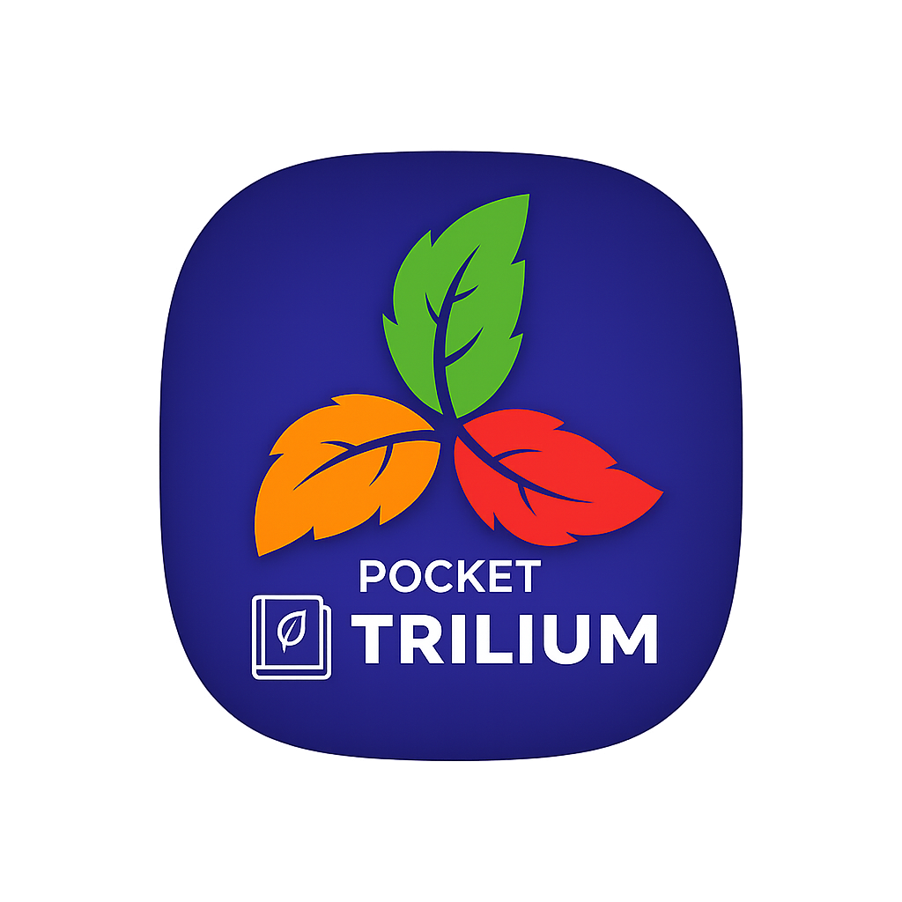
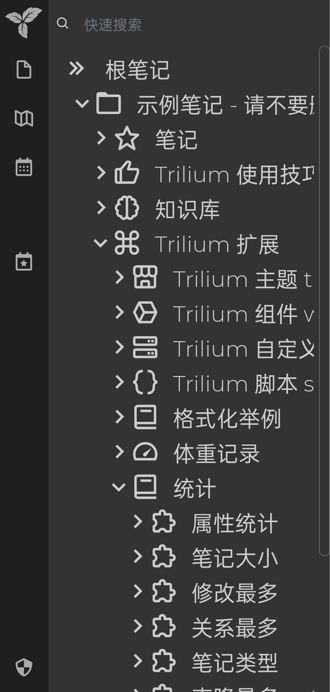
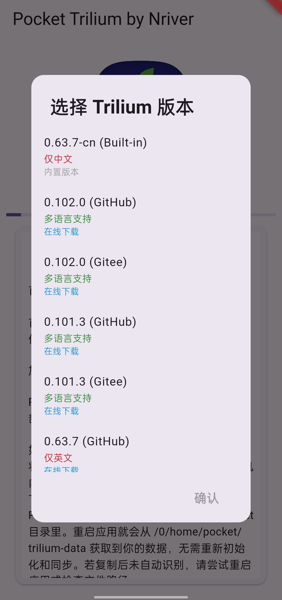
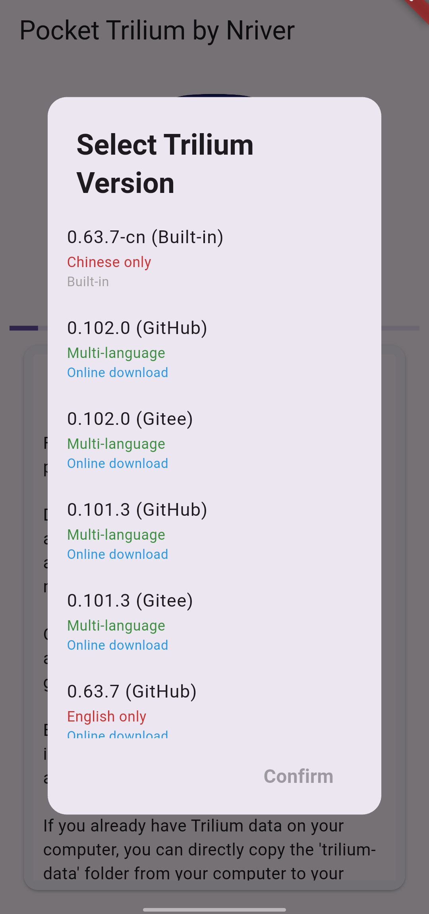
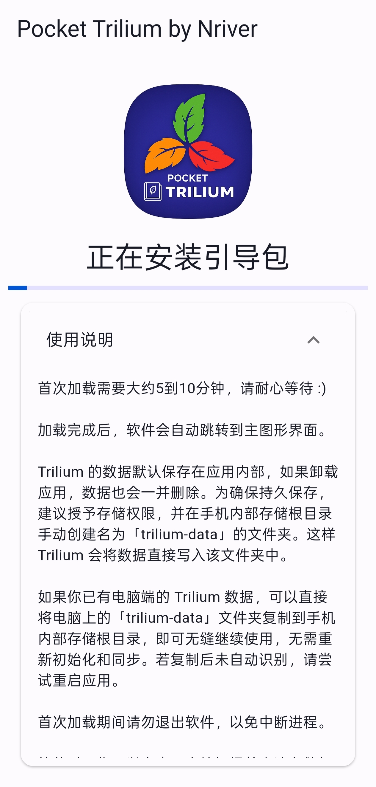
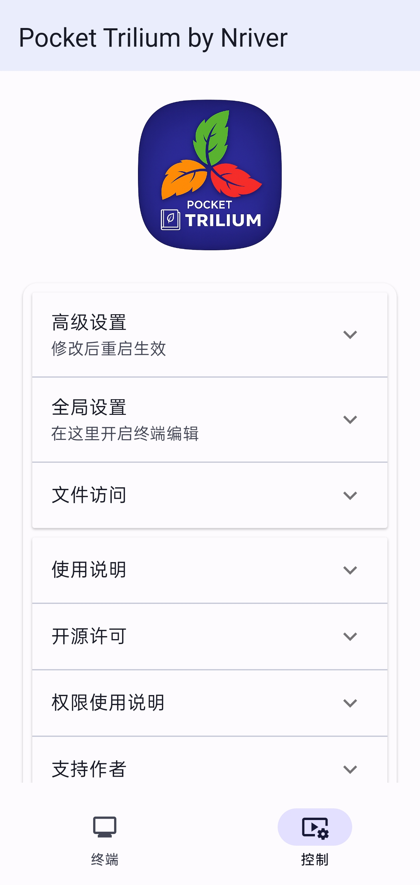
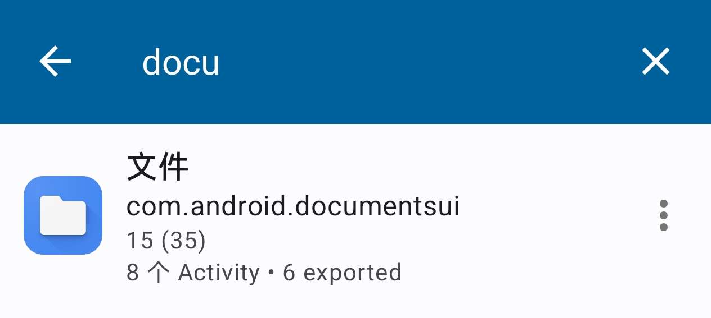
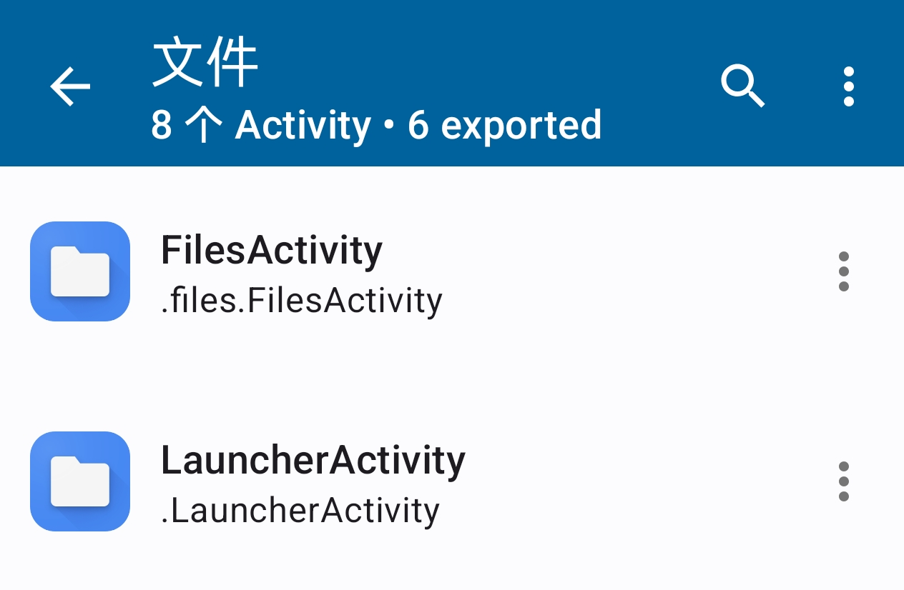
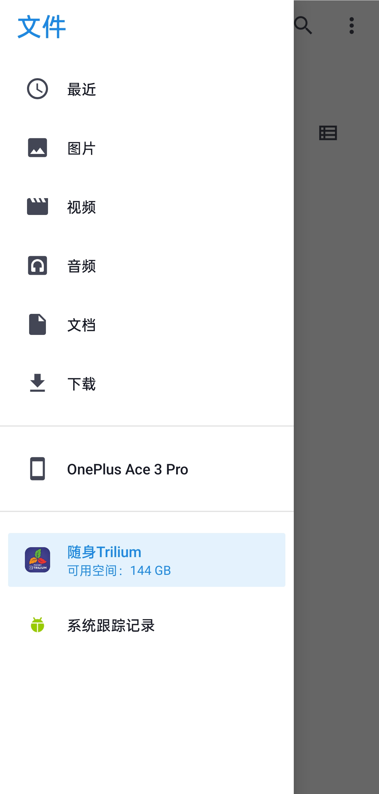

# 📱 Pocket Trilium

<p align="center">
** English ** | <a href="README_CN.md">简体中文</a>
</p>

**Run full-featured Trilium on Android. Take your second brain with you, right in your pocket :)**

[](https://play.google.com/store/apps/details?id=nriver.pocket.trilium)

Please stand up and stretch your body for a while if you see this message :)

[](https://ko-fi.com/nriver)



This project is inspired by and heavily modified from the [Cateners/tiny_computer](https://github.com/Cateners/tiny_computer) project.

---

# 📝 Overview

Pocket Trilium allows you to run the powerful [Trilium Notes](https://github.com/zadam/trilium) app on Android devices. While originally based on the [tiny_computer](https://github.com/Cateners/tiny_computer) project, this version has undergone significant modifications to better suit my needs.

---

# Screenshots

Run Trilium on your phone.



You can choose your Trilium version on first start.

<div style="display:flex; gap:12px;">
    
    
    
    
</div>

---

# Features

- [x] Choose Trilium version
- [x] Works offline
- [x] Copy `trilium-data` to phone and use it directly
- [x] Sync data with Trilium Server
- [x] You can access pocket trilium with http://your-phone-ip:8080 on your computer in the same wifi
- [x] Image upload from phone works now
- [x] `Back` button/gesture works in Trilium page now
- [x] Reinstall Trilium to upgrade
- [x] Manually clear cache
- [x] Open links in note with system default browser app 
- [x] Switch between mobile and desktop mode without restarting Pocket Trilium

---

# ⚙️ Setup Instructions

1. **The `trilium-data` Folder**:

  * You can setup the sync like other Trilium client do. Or, you can copy the `trilium-data` folder from your desktop client to your phone.
  * With Pocket Trilium open in the background, open android system's built-in File Manager (com.android.documentsui). Some system may hide this app by default, you can access it with https://github.com/sdex/ActivityManager

<p align="center">

</p>

<p align="center">

</p>

  * You can find Pocket Trilium's container storage in the top left hamburger button.

<p align="center">

</p>

  * Copy your `trilium-data` into Pocket Trilium's `/0/home/pocket/` folder, restart Pocket Trilium, it will read the data from `/0/home/pocket/trilium-data`.

---

# ❓ FAQ

## How can I Upgrade Trilium in the Pocket Trilium App ?

1. Open the app and navigate to `Control`.
   *If you're currently inside Trilium, you can return to Pocket Trilium’s main UI by pressing the back button or using swipe gesture on your Android device.*

2. Click `Global Settings`.

3. Turn on `Reinstall Trilium`.

   *Note: This operation will only remove the installed Trilium program itself and will not affect your Trilium data directory (trilium-data). Your data will remain intact after reinstalling, just like when you upgrade Trilium on a computer. You can rest assured that your data will not be lost during the upgrade process :)*

4. Restart the app.

Once the app restarts, you'll see a pop-up menu that allows you to select the Trilium version.

## Can not connect to Trilium behind Traefik — "unable to resolve internal DNS" or "cert mismatch" error

2 ways to solve this.
- Use server IP and Port instead of domain (works without SSL cert).
- If you need ssl, go to `Control - Advanced Settings - Trilium Startup Command` set your own dns server like this:

```
echo "nameserver 10.20.30.40" > /etc/resolv.conf
```

Refer to this [Reddit comment](https://www.reddit.com/r/Trilium/comments/1re0bf1/comment/o7bvaiz/)

---

# 🚧 Known issues

## ❌ App Fails to Start Occasionally

If the app fails to start, and you encounter an error such as `double free or corruption`, I've added a retry mechanism to start trilium for 10 times automatically if this happens.

If that does not work for you, try the following:

1. Force close the app.
2. Wait a few seconds to allow the system to terminate any associated processes.
3. Restart the app.

If needed, repeat this process a few times. The app should eventually start successfully.

### Fix for `double free or corruption` (v1.4.0 and above)

**Note:**  
This fix is mainly for users who upgraded from a version **below 1.4.0**.  
If you are a new user who installed Pocket Trilium **1.4.0 or later**, you are already using the rootfs with `jemalloc` version by default and usually will not encounter this issue.

1. Go to `Control → Advanced Settings`, find `Trilium Startup Command`, and click `Reset to Default`.

2. Go to `Control → Global Settings` and enable `Reinstall Rootfs`.

   **Note:** `Reinstall Rootfs` will only replace the underlying system environment. It will **not** affect your Trilium program files or your notes data in the `trilium-data` folder. Your data will remain completely safe.

3. Then restart the app, please wait patiently for 5–10 minutes.

## Child process limitation

If you're using an Android 12+ device, you may need to disable the "Stop restricting child processes" option in the `Developer Options` menu.

---

# 🚀 Improvements

- The APK size has reduced from over 1GB with 4GB of data to approximately 360MB with 1GB of data. Additionally, the first time startup time has decreased dramatically.
- Image upload is now working in the app.
- Starting from version 1.4.0, Pocket Trilium uses `jemalloc` as the memory allocator instead of the default `malloc`. This change significantly reduces the occurrence of `double free or corruption` errors and provides much better stability during long-running sessions.

## 🛠️ Development

To keep the repository size reasonable, several large files are **not included** in this repo. You will need to build them yourself.

- **`assets/xa*`** files (rootfs) — Build them by following the instructions in [rootfs.md](docs/rootfs.md).
- **`assets/trilium.tar.xz`** — Built-in Trilium Notes. The original 0.63.7 version requires recompilation for arm64 platforms. The included version is a recompiled Chinese localization from [Nriver/trilium-translation](https://github.com/Nriver/trilium-translation).
- **`android/app/src/main/jniLibs/arm64-v8a/*.so`** — Native libraries compiled and extracted from termux-packages. See detailed instructions in [jniLibs.md](docs/jniLibs.md).

---

# 🎉 Credits

A huge thank you to the [Cateners/tiny_computer](https://github.com/Cateners/tiny_computer) project for laying the groundwork for this project. The initial code for **Pocket Trilium** was based on the following commit: [6425e04](https://github.com/Cateners/tiny_computer/tree/6425e0443efce97b9882c76294bd4271daf39996).

While I’ve made many changes to adapt the project to my use case, I decided to start a new repository instead of maintaining it as a fork, since the goals of this project diverged significantly from the original.

Thank [Zadam](https://github.com/zadam) for creating the wonderful Trilium in the first place. Thanks to everyone in the Trilium community.

And some credit to my old studies years ago :) [Tutorial to Run Trilium Server in Termux on Android](https://github.com/orgs/TriliumNext/discussions/4542) and [Tutorial: Run TriliumNext Server in Termux on Android](https://github.com/orgs/TriliumNext/discussions/5992).

---

# 🙏 Closed Testing Thanks

A big thank you to everyone who participated in the Google Play closed testing of **Pocket Trilium**.

Your feedback, bug reports, and suggestions were incredibly helpful and directly influenced the stability and usability of the app before its public release.

The following names are provided voluntarily by the testers (nicknames or real names), listed in no particular order:

- Icixy
- 2sr.fun
- hishuxs
- ziven要加油啊
- 蓝天龙
- 辰星
- zm
- hikit
- YIGEHAOR8.
- Neuro
- 刘世杰
- catalpa
- 信
- 阿华田
- 欧神小白
- 腐草
- 风中笑
- Yida
- Cleavory
- AT
- 天涯056
- 卑以自牧
- joshooear
- 1v7w
- 李重茂
- Black bat 3625
- TonyMin
- 冰
- 小辉哥
- 浸月
- T_L
- Bry
- sang
- nsf

And thanks as well to all testers who chose to remain anonymous — your support is equally appreciated ❤️

---

# 📝 License

This project is licensed under the **GNU Affero General Public License v3.0**. See the [LICENSE](LICENSE) file for more details.

---

# 💖 Donation

Hello! If you appreciate my creations, kindly consider backing me. Your support is greatly appreciated. Thank you!

Ko-fi:  
[](https://ko-fi.com/nriver)

Alipay:  


Wechat Pay:  

