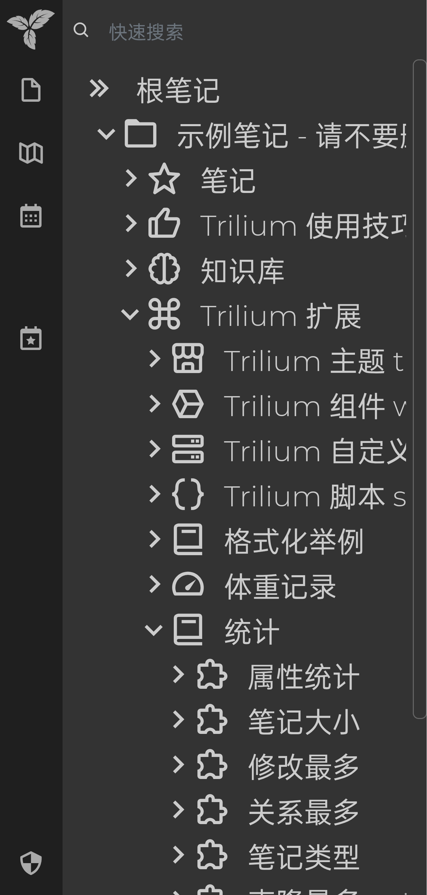
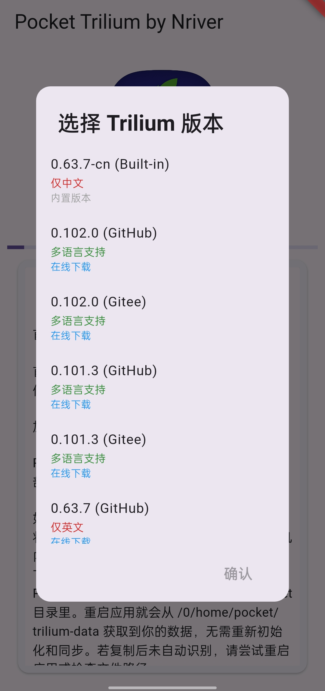
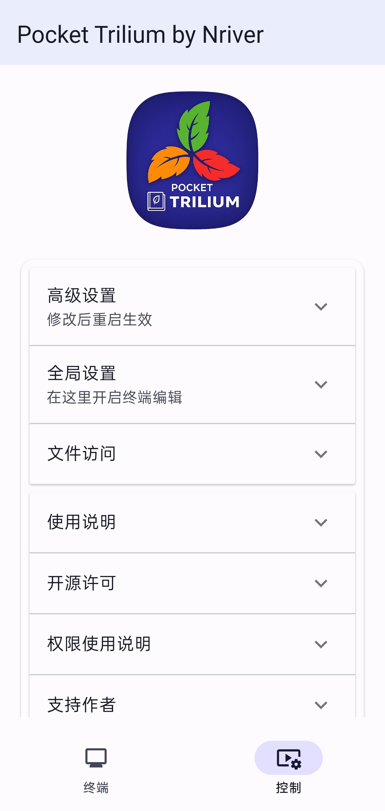
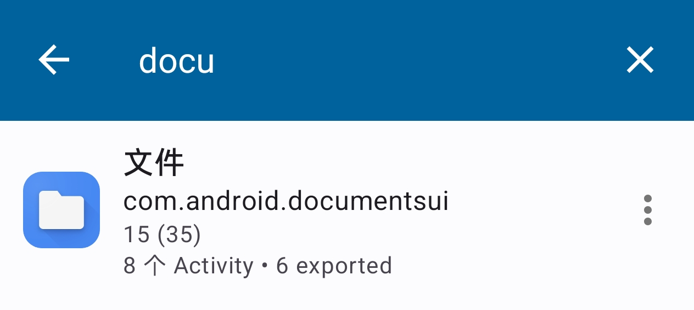
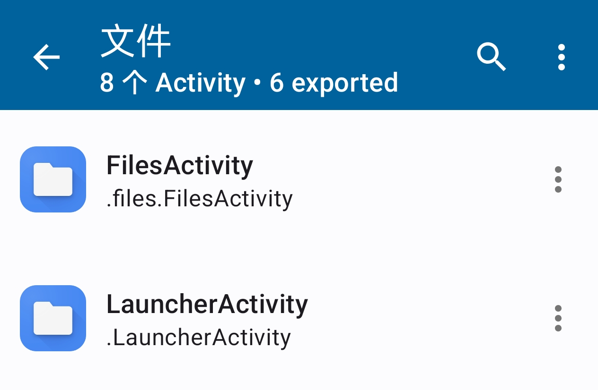
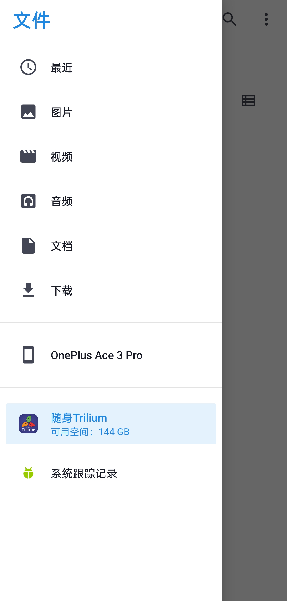

# 📱 Pocket Trilium

<a href="README.md">English</a> | **简体中文**

**在 Android 上运行完整功能的 Trilium，把你的第二大脑装进口袋 :) **

如果你看到这条消息，请站起来伸展一下身体 :)

本项目受 [Cateners/tiny_computer](https://github.com/Cateners/tiny_computer) 项目启发，并在其基础上进行了大量修改。

# 📝 项目介绍

Pocket Trilium 让你可以在 Android 设备上运行功能完整的 [Trilium Notes](https://github.com/zadam/trilium)。虽然最初基于 [tiny_computer](https://github.com/Cateners/tiny_computer) 项目，但本版本进行了大量修改，以更好地适配我的使用需求。

# Screenshots

在手机上运行 Trilium：

首次启动时可以选择 Trilium 版本：

# 功能特性

- [x] 可选择 Trilium 版本
- [x] 支持完全离线使用
- [x] 可直接复制 `trilium-data` 文件夹到手机使用
- [x] 支持与 Trilium Server 同步数据
- [x] 在同一 WiFi 下，可通过电脑访问 `http://你的手机IP:8080`
- [x] 已支持从手机上传图片
- [x] Trilium 页面内返回按钮/手势已正常工作
- [x] 可通过重新安装 Trilium 进行升级
- [x] 支持手动清除缓存

# ⚙️ 设置说明

1. **trilium-data 文件夹**

  * 你可以像其他 Trilium 客户端一样设置同步，也可以直接把桌面端的 `trilium-data` 文件夹复制到手机。
  * 在 Pocket Trilium 保持后台运行的状态下，打开 Android 系统自带的文件管理器（com.android.documentsui）。一些系统会隐藏这个应用，你可以通过这个App来访问它 https://github.com/sdex/ActivityManager

 
  * 在左侧侧边栏即可找到 Pocket Trilium 的存储空间。

  * 将你的 `trilium-data` 文件夹复制到 Pocket Trilium 的 `/0/home/pocket/` 目录下，重启应用即可从 `/0/home/pocket/trilium-data` 读取数据。

# 🚧 已知问题

## ❌ 应用偶尔无法启动

如果应用启动失败并出现 `double free or corruption` 等错误，我已加入自动重试机制（失败时会自动尝试启动 10 次）。

若仍无法启动，可尝试以下操作：

1. 强制停止应用
2. 等待几秒，让系统彻底结束相关进程
3. 重新打开应用

必要时重复几次，通常即可正常启动。

## 子进程限制问题

Android 12 及以上设备可能需要在「开发者选项」中关闭「停止限制子进程」选项。

# 🚀 主要改进

- APK 体积从原来的 1GB+（含 4GB 数据）大幅降低至约 360MB（含 1GB 数据），首次启动速度也显著提升。
- 图片上传功能现已正常可用。

# 🎉 致谢

非常感谢 [Cateners/tiny_computer](https://github.com/Cateners/tiny_computer) 项目为本项目奠定了基础。Pocket Trilium 的初始代码基于以下提交：[6425e04](https://github.com/Cateners/tiny_computer/tree/6425e0443efce97b9882c76294bd4271daf39996)。

由于项目目标已与原项目有较大差异，我选择新建仓库而非继续作为 fork 维护。

感谢 [Zadam](https://github.com/zadam) 创造了优秀的 Trilium，以及 Trilium 社区的所有朋友。

同时也感谢我多年前写下的两篇教程：
- [在 Termux 上运行 Trilium Server](https://github.com/orgs/TriliumNext/discussions/4542)
- [在 Termux 上运行 TriliumNext Server](https://github.com/orgs/TriliumNext/discussions/5992)

# 🙏 封闭测试特别感谢

衷心感谢所有参与 **Pocket Trilium** Google Play 封闭测试的朋友！

你们的反馈、Bug 报告和建议对应用的稳定性和可用性帮助极大。

以下是测试人员自愿留下的名字（昵称或真实姓名，不分先后）：

- Icixy
- 2sr.fun
- hishuxs
- ziven要加油啊
- 蓝天龙
- 辰星
- zm
- hikit
- YIGEHAOR8.
- Neuro
- 刘世杰
- catalpa
- 信
- 阿华田
- 欧神小白
- 腐草
- 风中笑
- Yida
- Cleavory
- AT
- 天涯056
- 卑以自牧
- joshooear
- 1v7w
- 李重茂
- Black bat 3625
- TonyMin
- 冰
- 小辉哥
- 浸月
- T_L
- Bry
- sang
- nsf

也感谢所有选择匿名的测试者，你们的支持同样宝贵 ❤️

# 📝 许可证

本项目采用 **GNU Affero General Public License v3.0** 许可。详情请见 [LICENSE](LICENSE) 文件。

# 💖 捐赠

如果你喜欢这个项目，欢迎支持我继续维护和开发：

**Ko-fi**  

**支付宝**  

**微信支付**  
